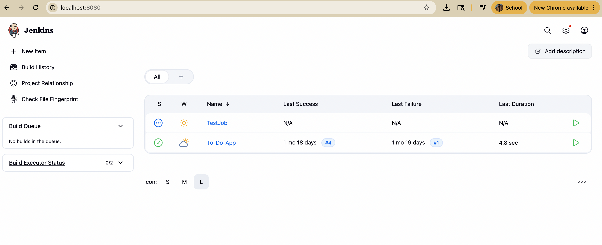
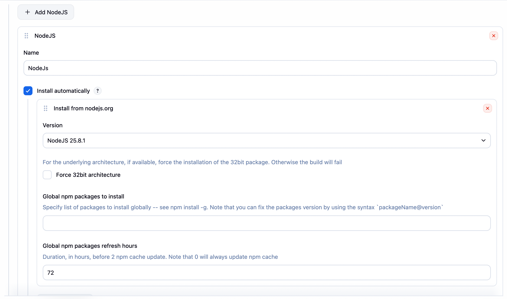
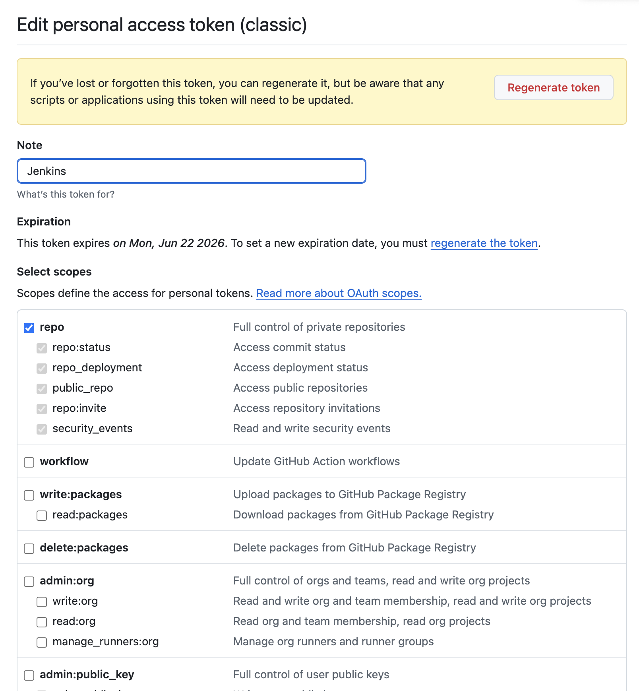
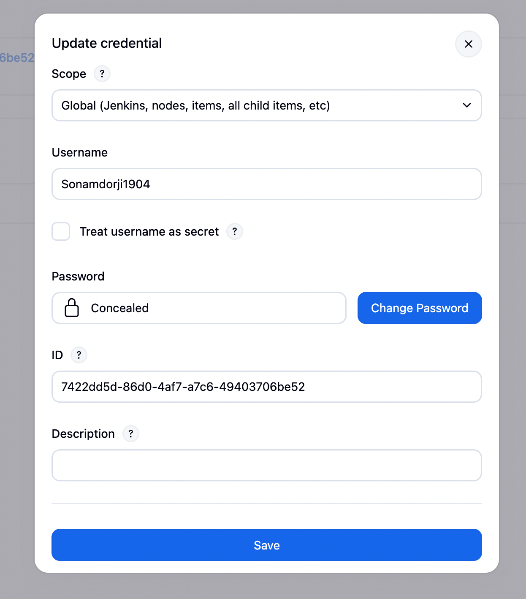
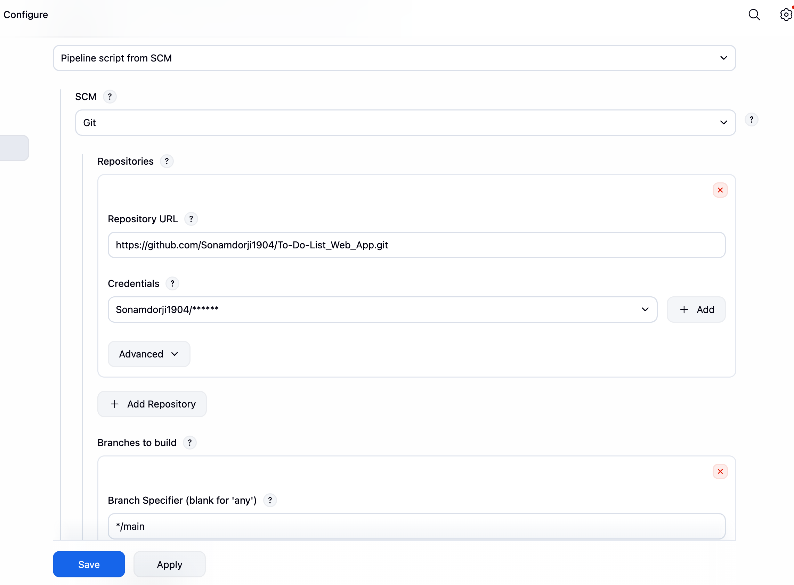
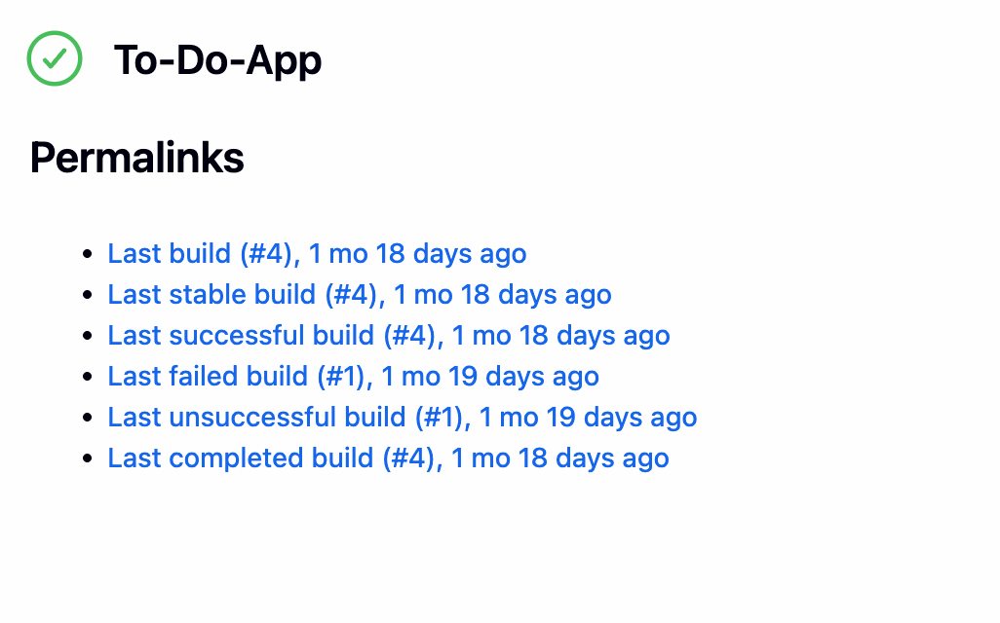
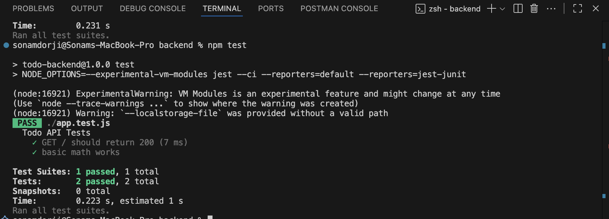

# DSO101 Assignment 2 — Jenkins CI/CD Pipeline

**Course:** Bachelor's of Engineering in Software Engineering (SWE)  
**Module:** DSO101 — Continuous Integration and Continuous Deployment  
**Submission:** GitHub Repository — `To-Do-List_Web_App`

---

## Table of Contents

- [Objective](#objective)
- [Tools & Technologies](#tools--technologies)
- [Task 1 — Jenkins Setup for Node.js](#task-1--jenkins-setup-for-nodejs)
- [Task 2 — GitHub Repository Setup](#task-2--github-repository-setup)
- [Task 3 — Jenkinsfile Pipeline Configuration](#task-3--jenkinsfile-pipeline-configuration)
- [Task 4 — Running the Pipeline](#task-4--running-the-pipeline)
- [Pipeline Output](#pipeline-output)
- [Challenges Faced](#challenges-faced)

---

## Objective

This assignment configures a Jenkins pipeline to automate the build, test, and deployment of the to-do list application from Assignment 1. The pipeline covers:

- Code checkout from GitHub
- Dependency installation via npm
- Build step
- Unit testing with Jest
- Deployment via Docker Hub

---

## Tools & Technologies

| Tool | Purpose |
|------|---------|
| Jenkins | CI/CD automation |
| GitHub | Source code hosting |
| Node.js & npm | JavaScript runtime & package management |
| Jest / jest-junit | Testing framework & JUnit report generation |
| Docker | Containerization and image deployment |

---

## Task 1 — Jenkins Setup for Node.js

### Step 1: Install Jenkins

- Downloaded Jenkins from [jenkins.io/download](https://jenkins.io/download)
- Started Jenkins and accessed it at `http://localhost:8080`
- Completed the initial setup wizard and created an admin account

**Screenshot — Jenkins running on localhost:8080:**



---

### Step 2: Install Required Plugins

Navigated to **Manage Jenkins > Plugins > Available** and installed the following plugins:

- **NodeJS Plugin** — enables npm inside pipeline stages
- **Pipeline** — enables Jenkinsfile-based declarative pipelines
- **GitHub Integration** — connects Jenkins to GitHub repositories
- **Docker Pipeline** — enables Docker build and push steps


---

### Step 3: Configure Node.js in Jenkins

1. Navigated to **Manage Jenkins > Tools > NodeJS**
2. Added a Node.js installation (LTS v20.x)
3. Confirmed npm was detected automatically

**Screenshot — Node.js configured in Jenkins Tools:**


---

## Task 2 — GitHub Repository Setup

### Step 1: Repository on GitHub

The to-do list application from Assignment 1 is hosted at:  
`https://github.com/yourusername/assignment1-node-app`

The `Jenkinsfile` was added to the root of the repository.


---

### Step 2: Generate a GitHub Personal Access Token (PAT)

1. Navigated to **GitHub > Settings > Developer Settings > Personal Access Tokens**
2. Generated a new token with the following permissions:
   - `repo`
   - `admin:repo_hook`
3. Copied the token securely for use in Jenkins

**Screenshot — GitHub PAT creation:**



---

### Step 3: Add GitHub Credentials in Jenkins

1. Navigated to **Manage Jenkins > Credentials > Add Credentials**
2. Selected type: **Username & Password**
   - Username: GitHub username
   - Password: GitHub PAT generated above
3. Saved the credentials with an identifiable ID (e.g., `github-creds`)

**Screenshot — Jenkins credentials configuration:**



---

## Task 3 — Jenkinsfile Pipeline Configuration

### package.json Scripts

The following scripts and dev dependencies were added to `package.json` to support the pipeline:

```bash
npm install --save-dev jest
npm install --save-dev jest-junit
```

```json
{
  "scripts": {
    "test": "jest --ci --reporters=default --reporters=jest-junit",
    "build": "npm run build"
  }
}
```

---

### Jenkinsfile

The following `Jenkinsfile` was created at the root of the repository:

```groovy
pipeline {
    agent any

    tools {
        nodejs 'NodeJS'
    }

    stages {
        stage('Checkout') {
            steps {
                git branch: 'main',
                    url: 'https://github.com/Sonamdorji1904/To-Do-List_Web_App.git',
                    credentialsId: 'github-creds'
            }
        }

        stage('Install') {
            steps {
                sh 'npm install'
            }
        }

        stage('Build') {
            steps {
                sh 'npm run build'
            }
        }

        stage('Test') {
            steps {
                sh 'npm test'
            }
            post {
                always {
                    junit 'junit.xml'
                }
            }
        }

        stage('Deploy') {
            steps {
                script {
                    docker.withRegistry('https://registry.hub.docker.com', 'docker-hub-creds') {
                        // Build and push backend image
                        def backendImage = docker.build('sonamdorji2005/be-todo:02240362', 'Backend')
                        backendImage.push()

                        // Build and push frontend image
                        def frontendImage = docker.build('sonamdorji2005/fe-todo:02240362', 'Frontend')
                        frontendImage.push()
                    }
                }
            }
        }
    }
}
```

---

## Task 4 — Running the Pipeline

### Step 1: Create a New Pipeline in Jenkins

1. Clicked **New Item** in Jenkins dashboard
2. Named the pipeline and selected **Pipeline** as the type
3. Clicked **OK**


---

### Step 2: Configure the Pipeline

Under the pipeline configuration:

- **Definition:** Pipeline script from SCM
- **SCM:** Git
- **Repository URL:** `https://github.com/yourusername/assignment1-node-app`
- **Credentials:** Selected the GitHub PAT credentials added earlier
- **Script Path:** `Jenkinsfile`

Clicked **Save**.

**Screenshot — Pipeline SCM configuration:**


---

### Step 3: Build Now

Clicked **Build Now** to trigger the first pipeline run and monitored the **Console Output** for each stage.

**Screenshot — Pipeline triggered and running:**


---

## Pipeline Output

### Successful Build Logs

Each stage completed successfully:

- **Checkout** — Source code pulled from GitHub `main` branch
- **Install** — `npm install` completed with no errors
- **Build** — Project built successfully
- **Test** — All Jest unit tests passed;generated
- **Deploy** — Docker image built and pushed to Docker Hub

**Screenshot — Successful pipeline execution (all stages green):**


---

### Test Results

Jest tests were run with the `jest-junit` reporter, generating a `junit.xml` file. Jenkins published the results under **Test Results**.

**Screenshot — Test results in Jenkins:**


---

### Docker Hub Image

The Docker image was successfully pushed to Docker Hub.

Frontend Image Pull - `docker push sonamdorji2005/fe-todo:02240362`
Backend Image Pull - `docker push sonamdorji2005/be-todo:02240362`

**Screenshot — Docker Hub showing pushed image:**


---

## Challenges Faced

| Challenge | How It Was Resolved |
|-----------|---------------------|
| Node.js not detected in pipeline | Configured Node.js LTS under **Manage Jenkins > Tools** and matched the name exactly in the `tools {}` block of the Jenkinsfile |
| `junit.xml` not found after tests | Added `jest-junit` as a dev dependency and updated the `test` script in `package.json` to use the JUnit reporter |
| Docker credentials rejected | Created a separate Jenkins credential entry with ID `docker-hub-creds` matching exactly what was referenced in the Jenkinsfile |
| GitHub webhook not triggering builds | Verified the PAT had 

---

## References

- [Jenkins Documentation](https://www.jenkins.io/doc/)
- [Jenkins NodeJS Plugin](https://plugins.jenkins.io/nodejs/)
- [Jest Documentation](https://jestjs.io/docs/getting-started)
- [jest-junit Reporter](https://github.com/jest-community/jest-junit)
- [Docker Pipeline Plugin](https://plugins.jenkins.io/docker-workflow/)
- [GitHub Personal Access Tokens](https://docs.github.com/en/authentication/keeping-your-account-and-data-secure/managing-your-personal-access-tokens)