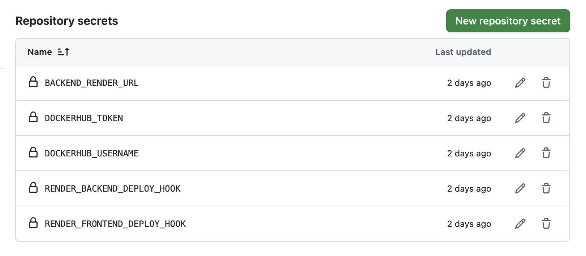
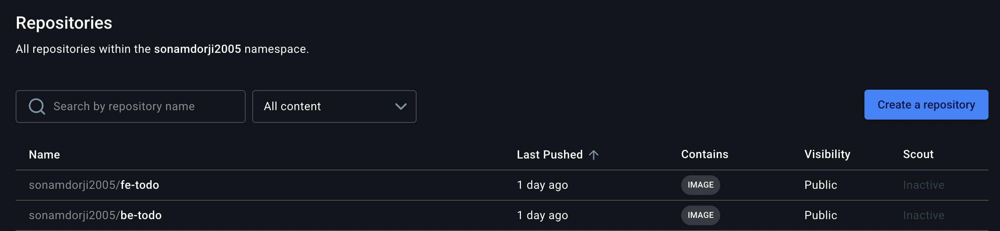
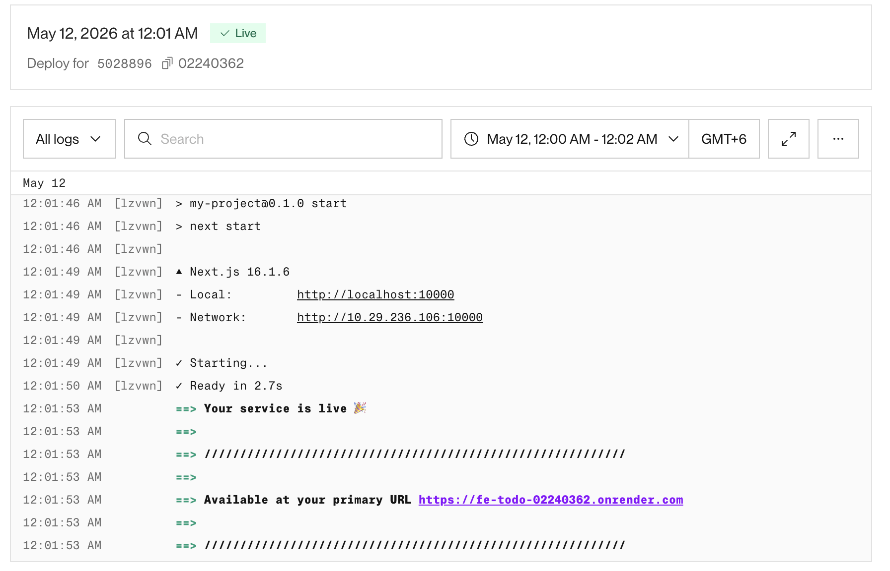
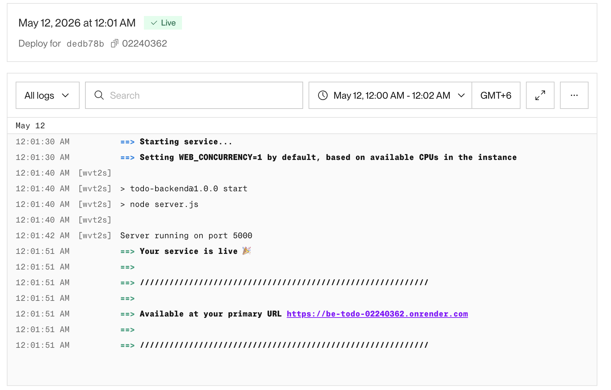

# DSO101 Assignment 3 — GitHub Actions CI/CD Pipeline

**Course:** Bachelor's of Engineering in Software Engineering (SWE)  
**Module:** DSO101 — Continuous Integration and Continuous Deployment  
**Submission:** GitHub Repository — `To-Do-List_Web_App`

---

## Table of Contents

- [Objective](#objective)
- [Tools & Technologies](#tools--technologies)
- [Task 1 — GitHub Repository Setup](#task-1--github-repository-setup)
- [Task 2 — Docker Setup & Local Testing](#task-2--docker-setup--local-testing)
- [Task 3 — GitHub Actions Workflow](#task-3--github-actions-workflow)
- [Task 4 — Render.com Deployment](#task-4--rendercom-deployment)
- [Pipeline Output](#pipeline-output)
- [Challenges Faced](#challenges-faced)
- [Learning Outcomes](#learning-outcomes)
- [Live Deployment](#live-deployment)

---

## Objective

This assignment configures a GitHub Actions workflow to automate:

1. Building a Docker container for the to-do list application
2. Pushing the container image to DockerHub
3. Deploying the container on Render.com via a deployment webhook

---

## Tools & Technologies

| Tool | Purpose |
|------|---------|
| GitHub | Source code hosting |
| GitHub Actions | CI/CD automation |
| Docker | Containerization |
| DockerHub | Container registry |
| Render.com | Cloud deployment |
| Node.js & npm | Backend runtime & package management |
| Jest | Testing framework |

---

## Task 1 — Docker Setup & Local Testing

### Step 1: Verify Dockerfile

The `Dockerfile` was present in the repository root (or in `/backend` for multi-service setups) with the following configuration:

```dockerfile
# Frontend/Dockerfile
FROM node:22-alpine
WORKDIR /app
COPY package*.json ./
RUN npm install
COPY . .
RUN npm run build

FROM node:22-alpine
WORKDIR /app
COPY --from=builder /app ./
EXPOSE 3000
CMD ["npm", "start"]
```

---

## Task 2 — GitHub Actions Workflow

### Step 1: Create the Workflow File

The file `.github/workflows/deploy.yml` was created in the repository with the following content:

```yaml
name: Build and Deploy

on:
  push:
    branches: ["main"]

jobs:
  build-and-deploy:
    runs-on: ubuntu-latest

    steps:
      # 1. Checkout the repository code
      - name: Checkout Repository
        uses: actions/checkout@v4

      # 2. Log in to DockerHub
      - name: Login to DockerHub
        uses: docker/login-action@v3
        with:
          username: ${{ secrets.DOCKERHUB_USERNAME }}
          password: ${{ secrets.DOCKERHUB_TOKEN }}

      # 3. Build and push the backend image
      #    Context is ./Backend so Docker uses Backend/dockerfile
      - name: Build and Push Backend Image
        run: |
          docker build \
            -t ${{ secrets.DOCKERHUB_USERNAME }}/be-todo:02240362 \
            -t ${{ secrets.DOCKERHUB_USERNAME }}/be-todo:latest \
            ./Backend
          docker push ${{ secrets.DOCKERHUB_USERNAME }}/be-todo:02240362
          docker push ${{ secrets.DOCKERHUB_USERNAME }}/be-todo:latest

      # 4. Build and push the frontend image
      #    Pass the production backend Render URL as a build argument
      #    so Next.js bakes it into the compiled JS bundle
      - name: Build and Push Frontend Image
        run: |
          docker build \
            --build-arg NEXT_PUBLIC_API_URL=${{ secrets.BACKEND_RENDER_URL }} \
            -t ${{ secrets.DOCKERHUB_USERNAME }}/fe-todo:02240362 \
            -t ${{ secrets.DOCKERHUB_USERNAME }}/fe-todo:latest \
            ./Frontend
          docker push ${{ secrets.DOCKERHUB_USERNAME }}/fe-todo:02240362
          docker push ${{ secrets.DOCKERHUB_USERNAME }}/fe-todo:latest

      # 5. Tell Render to pull the new backend image and redeploy
      - name: Trigger Backend Render Deployment
        run: |
          curl -X POST "${{ secrets.RENDER_BACKEND_DEPLOY_HOOK }}"

      # 6. Tell Render to pull the new frontend image and redeploy
      - name: Trigger Frontend Render Deployment
        run: |
          curl -X POST "${{ secrets.RENDER_FRONTEND_DEPLOY_HOOK }}"
```

---

### Step 2: Add GitHub Secrets

The following secrets were added under **GitHub Repository > Settings > Secrets and Variables > Actions**:

**Screenshot — GitHub Secrets Configured:**


---


### DockerHub Image Pushed

The Docker image was successfully pushed to DockerHub after each commit to `main`.

**Screenshot — DockerHub repository showing latest pushed image:**



---

### Render.com Deployment

The Render service automatically redeployed the latest image after the webhook was triggered by GitHub Actions.

**Screenshot — Render deployment logs showing successful redeploy:**


---



---

## Challenges Faced

| Challenge | How It Was Resolved |
|-----------|---------------------|
| Render not redeploying after DockerHub push | Found that Render requires a webhook call to trigger redeployment; added a `curl` step in the GitHub Actions workflow to hit the Render deploy webhook |
| `npm test` failing inside Docker build | Ran tests locally first to fix test issues before including `RUN npm test` in the Dockerfile |
| Secrets not being read in workflow | Verified exact secret names matched between GitHub Settings and the `${{ secrets.DOCKER_USERNAME }}` references in `deploy.yml` |

---

## Learning Outcomes

- Understood how to build and push Docker images automatically using GitHub Actions without any manual steps
- Learned that cloud platforms like Render require explicit webhook calls to pull and redeploy updated images this is not automatic
- Gained experience managing sensitive credentials securely using GitHub Secrets instead of hardcoding values
- Practised writing a complete CI/CD pipeline from code push to live deployment in a single workflow file
- Understood the role of each tool in the pipeline: GitHub (source), Actions (automation), Docker (packaging), DockerHub (registry), Render (hosting)

---

## Live Deployment

**Render Deployment URL:** `https://fe-todo-02240362.onrender.com`

---

## References

- [GitHub Actions Documentation](https://docs.github.com/en/actions)
- [DockerHub Access Tokens](https://docs.docker.com/security/for-developers/access-tokens/)
- [Render Deploy Webhooks](https://render.com/docs/deploy-hooks)
- [Render — Deploy from Registry](https://render.com/docs/deploying-an-image)
- [Docker Documentation](https://docs.docker.com/)